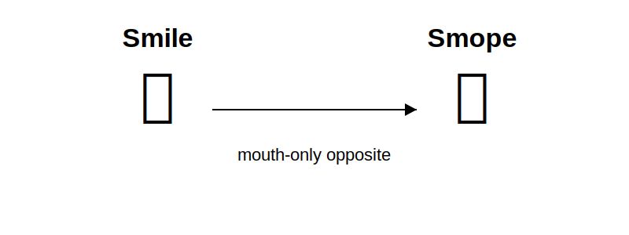

# Smope 🙁

## A proposed word for the mouth-only opposite of a smile

English has a simple word for this:

🙂 **smile**

But apparently no equally simple, widely accepted word for this:

🙁 **?**

A *frown* often involves the eyebrows and forehead. A *pout* involves protruding lips. A *grimace* suggests pain, disgust, or discomfort.

None of those words precisely describes the simple physical action of turning the corners of the mouth downward.

## Evidence of the lexical gap

The proposal arose after examining common English vocabulary and discussions of facial expressions.

Existing terms include:

* smile
* frown
* pout
* grimace
* sneer
* smirk
* scowl

Each denotes either:

* a broader facial expression,
* a particular emotion,
* or a different mouth configuration.

None appears to refer exclusively to the downward curvature of the mouth corners.

This repository proposes a word for that missing concept:

# **smope**

**Pronunciation:** /smoʊp/
Rhymes with *hope*.

## Definition

### smope

**noun**

A downward curvature of the corners of the mouth, considered independently of the eyebrows or any particular emotion.

> A faint smope appeared on her face.

**verb**

To turn the corners of the mouth downward, without necessarily frowning, pouting, or expressing a specific emotion.

> He smoped sympathetically.

> She did not frown; she simply smoped.

## Dictionary entry

**smope**
/smoʊp/

**noun**

1. The downward curvature of the corners of the mouth.

**verb**

1. To turn the corners of the mouth downward.

**Example:**

She smoped sympathetically.

## Why not “frown”?

In ordinary usage, *frown* often refers to tension or movement in the eyebrows, forehead, or face as a whole. It can also imply anger, concern, concentration, or disapproval.

A **smope** refers specifically to the shape of the mouth:

* **smile:** corners of the mouth turn upward
* **smope:** corners of the mouth turn downward

The word describes the visible movement, not its emotional interpretation.

## Why “smope”?

The word is:

* short;
* easy to pronounce;
* usable as both a noun and a verb;
* reminiscent of *smile*, *slope*, *mope*, and *droop*;
* emotionally neutral enough to describe sadness, sympathy, disappointment, uncertainty, or deliberate facial posing.

It also feels like a word that could already have existed.

## Related term: downsmile

**Downsmile** is proposed here as a transparent alternative or descriptive synonym, and—like **smope**—is first formally defined and claimed in this repository.

> She gave a small downsmile.

### Conceptual distinction

* **downsmile** *(technical, transparent)*
* **smope** *(everyday, lexicalized)*

Exactly how we have:

* automobile → car
* photograph → photo
* refrigerator → fridge

### Definitions

**downsmile** *(noun, verb)*
A downward curvature of the corners of the mouth, irrespective of emotion. The term is purely descriptive and refers only to the geometry of the mouth, without implying eyebrow movement, lip protrusion, or any specific emotional state.

**smope** *(noun, verb)*
A colloquial term for a downsmile; the compact, everyday lexical form of the same concept.

## Examples

> The child smoped when the ice cream fell.

> His mouth formed a slight smope, though his eyebrows remained relaxed.

> She answered with a sympathetic downsmile.

> It was not quite a pout and not really a frown. It was a smope.

> “Don’t smope,” he said. “We’ll try again tomorrow.”

## Proposed forms

| Form                  | Word              |
| --------------------- | ----------------- |
| Base verb             | smope             |
| Third-person singular | smopes            |
| Present participle    | smoping           |
| Past tense            | smoped            |
| Noun                  | smope             |
| Plural noun           | smopes            |
| Person who smopes     | smoper            |
| Adjective             | smoping or smoped |

## Status

**Smope is a proposed neologism.**

This repository does not claim that no comparable word has ever existed in any of the world’s languages. It records a proposal for concise English words filling an apparent lexical gap.

Both **smope** and **downsmile** are first formally proposed and documented here in **2026**.

## How words become real

No institution officially approves new English words.

A word becomes part of a language when people begin using it, understanding it, repeating it, and applying it in new situations.

So:

1. Use **smope** in a sentence.
2. Share the word.
3. Correct people when they call every downturned mouth a frown.
4. Let usage decide whether the word survives.

## Contributing

Examples, translations, linguistic research, historical parallels, illustrations, and evidence of independent usage are welcome.

Please open an issue or submit a pull request.

## Citation

Suggested citation:

> “Smope: A proposed word for the mouth-only opposite of a smile.” First publicly documented in 2026.

## License

The word **smope** is offered freely for public use.

No permission is required to speak it, write it, define it, translate it, criticize it, improve it, or help it enter the language.

---

🙂 **smile**

🙁 **smope**
